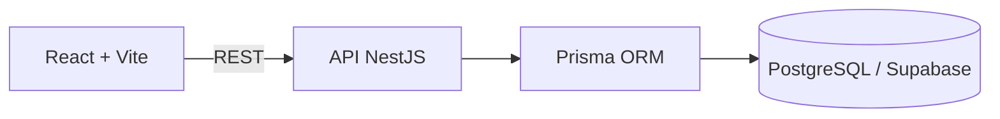

# DigiTicket

Plataforma full-stack para publicação de eventos, venda de ingressos e validação de entrada na portaria.

> Status atual: Fase 7.1 — transferência segura de ingressos entre contas implementada.

## Sobre

O DigiTicket será desenvolvido de forma incremental. A prioridade é entregar primeiro o fluxo principal completo:

```text
Organizador publica evento
        ↓
Cliente reserva e paga
        ↓
Ingresso é emitido
        ↓
Portaria valida a entrada
```

Este README acompanha a evolução do projeto. Uma funcionalidade só será apresentada como disponível depois de implementada e verificada.

## Incluído atualmente

- Frontend com React, Vite e TypeScript.
- React Router para organização das rotas.
- TanStack Query para comunicação e estado da API.
- React Hook Form e Zod preparados para os formulários.
- Tailwind CSS configurado.
- Backend com NestJS e TypeScript estrito.
- Prisma configurado para PostgreSQL/Supabase.
- Projeto Supabase provisionado em São Paulo (`sa-east-1`).
- Data API desativada e RLS automático habilitado para novas tabelas públicas.
- Swagger/OpenAPI disponível em `/api/docs`.
- Health check disponível em `/api/health`.
- Validação global das requisições no NestJS.
- Configuração inicial de CORS, Helmet e limite de requisições.
- Arquivos `.env.example` documentados.
- Arquivos `.env` locais protegidos pelo `.gitignore`.
- Testes iniciais do health check.
- Modelo `User` e enum de papéis `ORGANIZER`, `CUSTOMER` e `GATE`.
- Migration versionada para usuários e papéis.
- Seed idempotente com quatro usuários de demonstração.
- Cadastro público restrito ao papel `CUSTOMER`.
- Login com bcrypt e emissão de JWT.
- Guards globais de autenticação e autorização baseada em papéis.
- Endpoints `POST /auth/register`, `POST /auth/login` e `GET /auth/me`.
- Limite específico de tentativas nos endpoints de cadastro e login.
- Telas de cadastro e login no frontend.
- Sessão persistida no navegador, logout e rota de perfil protegida.
- Testes unitários e e2e para cadastro, login, JWT e acesso por papel.
- Modelo `Event` com categorias, modos de venda e estados de publicação.
- CRUD de eventos restrito ao organizador proprietário.
- Publicação, cancelamento e exclusão segura de rascunhos.
- Slugs legíveis e únicos para URLs públicas.
- Catálogo público com busca, categoria, cidade, data e ordenação cronológica.
- Página pública de detalhes do evento.
- Dashboard inicial do organizador com métricas e gestão de eventos.
- Seed com um evento publicado e um rascunho de demonstração.
- Tipos de ingresso por quantidade com preço inteiro em centavos.
- Gestão de capacidade e disponibilidade pelo organizador.
- Preço inicial exibido no catálogo público.
- Seleção de quantidades na página do evento.
- Reservas de ingressos com duração de 10 minutos.
- Cálculo do total exclusivamente no backend.
- Bloqueio atômico de estoque para impedir reservas acima da disponibilidade.
- Expiração lazy e cancelamento com devolução transacional ao estoque.
- Página protegida `Minhas reservas` com contagem regressiva.
- Constraints no PostgreSQL para impedir valores e estoques inválidos.
- Checkout protegido para reservas pendentes.
- Pagamento simulado com aprovação e recusa explícitas.
- Nenhum dado real de cartão solicitado ou armazenado.
- Valor do pagamento recalculado exclusivamente no backend.
- Aprovação transacional da reserva e criação de um ingresso-base por unidade.
- Recusa transacional com devolução imediata do estoque.
- Proteção contra duas confirmações simultâneas da mesma reserva.
- Histórico de pagamentos relacionado individualmente às reservas.
- Um ingresso individual gerado para cada unidade aprovada.
- Código interno aleatório e código manual único por ingresso.
- QR Code protegido por assinatura HMAC-SHA256.
- Página `Meus Ingressos` e detalhe individual protegido por proprietário.
- Links públicos de compartilhamento com token aleatório.
- Geração de novo link e revogação imediata do link anterior.
- Visualização compartilhada sem transferência de propriedade.
- Área exclusiva para o papel `GATE` com seleção de evento.
- Leitura de QR Code pela câmera e entrada por código manual.
- Resultados claros: `VALID`, `INVALID`, `WRONG_EVENT` e `ALREADY_USED`.
- Consumo atômico do ingresso para impedir duas entradas simultâneas.
- Histórico das tentativas de validação sem armazenar o código apresentado em texto puro.
- Solicitação de transferência gratuita para outra conta `CUSTOMER` pelo e-mail.
- Aceite, recusa e cancelamento de transferências pendentes.
- Troca transacional de titularidade com novos QR e código manual.
- Bloqueio do ingresso na portaria enquanto a transferência aguarda decisão.
- Histórico de transferências recebidas e enviadas.

## Autenticação

| Método | Endpoint | Acesso | Finalidade |
| --- | --- | --- | --- |
| `POST` | `/api/auth/register` | Público | Cria exclusivamente uma conta `CUSTOMER`. |
| `POST` | `/api/auth/login` | Público | Valida as credenciais e emite um JWT. |
| `GET` | `/api/auth/me` | Bearer JWT | Retorna o usuário autenticado. |

Estas contas estão disponíveis no ambiente configurado:

| Papel | E-mail | Senha |
| --- | --- | --- |
| Organizador | `organizador@demo.com` | `Demo123!` |
| Cliente | `cliente1@demo.com` | `Demo123!` |
| Cliente | `cliente2@demo.com` | `Demo123!` |
| Portaria | `portaria@demo.com` | `Demo123!` |

## Eventos

Somente eventos com status `PUBLISHED` aparecem no catálogo. Eventos novos sempre nascem como `DRAFT`, e somente o organizador proprietário pode consultá-los ou alterá-los na área de gestão.

| Método | Endpoint | Acesso | Finalidade |
| --- | --- | --- | --- |
| `GET` | `/api/events` | Público | Lista eventos publicados com busca e filtros. |
| `GET` | `/api/events/:slug` | Público | Exibe os detalhes de um evento publicado. |
| `GET` | `/api/organizer/events` | Organizador | Lista exclusivamente os eventos próprios. |
| `POST` | `/api/organizer/events` | Organizador | Cria um evento em rascunho. |
| `PATCH` | `/api/organizer/events/:id` | Organizador proprietário | Edita um evento não cancelado. |
| `POST` | `/api/organizer/events/:id/publish` | Organizador proprietário | Publica um evento. |
| `POST` | `/api/organizer/events/:id/cancel` | Organizador proprietário | Cancela sem apagar o histórico. |
| `DELETE` | `/api/organizer/events/:id` | Organizador proprietário | Exclui somente um rascunho. |

O seed inclui `Festival Luzes da Cidade`, publicado no catálogo, e `Mostra de Cinema Brasileiro`, mantido como rascunho no dashboard do organizador.

O festival possui os tipos de ingresso `Pista` e `Pista Premium`. Um evento de entrada geral precisa ter pelo menos um tipo de ingresso antes de ser publicado. Eventos com assentos reservados serão liberados somente quando o mapa de assentos estiver implementado.

## Estoque e reservas

Preços são armazenados como inteiros em `priceCents`: `R$ 70,00`, por exemplo, é persistido como `7000`. A capacidade representa o estoque total e `availableQuantity` representa o que ainda pode ser reservado.

| Método | Endpoint | Acesso | Finalidade |
| --- | --- | --- | --- |
| `GET` | `/api/organizer/events/:eventId/ticket-types` | Organizador proprietário | Lista os tipos de ingresso do evento. |
| `POST` | `/api/organizer/events/:eventId/ticket-types` | Organizador proprietário | Cria um tipo e seu estoque inicial. |
| `PATCH` | `/api/organizer/events/:eventId/ticket-types/:id` | Organizador proprietário | Altera dados e capacidade sem invalidar reservas. |
| `DELETE` | `/api/organizer/events/:eventId/ticket-types/:id` | Organizador proprietário | Exclui um tipo sem histórico de reservas. |
| `POST` | `/api/reservations/events/:eventId` | Cliente | Reserva quantidades disponíveis por 10 minutos. |
| `GET` | `/api/reservations` | Cliente | Lista somente as próprias reservas. |
| `GET` | `/api/reservations/:id` | Cliente proprietário | Exibe uma reserva própria. |
| `POST` | `/api/reservations/:id/cancel` | Cliente proprietário | Cancela uma reserva pendente e libera o estoque. |

O estoque é reduzido dentro de uma transação com uma atualização condicional equivalente a:

```sql
UPDATE ticket_types
SET available_quantity = available_quantity - :quantity
WHERE id = :id
  AND available_quantity >= :quantity;
```

A reserva só é criada se todas as atualizações forem bem-sucedidas. Em caso de falha, a transação inteira é revertida. Itens são processados em uma ordem consistente para reduzir risco de deadlock. Constraints adicionais garantem no banco que a disponibilidade nunca seja negativa nem maior que a capacidade.

Reservas vencidas são processadas de forma lazy ao consultar catálogo e reservas ou ao iniciar uma nova reserva. A mudança de estado é condicional, portanto somente um processo consegue liberar cada reserva. Essa estratégia mantém o fluxo correto sem depender exclusivamente de um job em memória.

### Como testar a fase atual

1. Entre como organizador e abra `Gerenciar ingressos` no evento de entrada geral.
2. Crie ou edite um tipo de ingresso e confira preço, capacidade e disponibilidade.
3. Saia e entre como `cliente1@demo.com`.
4. Abra o `Festival Luzes da Cidade`, escolha quantidades e reserve.
5. Abra `Minhas reservas` e confira itens, total calculado e contagem regressiva.
6. Cancele a reserva e confirme que a quantidade retorna ao catálogo.
7. Para testar a expiração, deixe uma reserva vencer e atualize o catálogo ou a página de reservas após 10 minutos.

## Checkout e pagamento simulado

O checkout existe somente para demonstrar as regras da compra. Nenhuma cobrança financeira é realizada e a interface não possui campos de cartão. O cliente escolhe deliberadamente entre `APPROVED` e `DECLINED`.

| Método | Endpoint | Acesso | Finalidade |
| --- | --- | --- | --- |
| `POST` | `/api/payments/reservations/:reservationId/simulate` | Cliente proprietário | Simula aprovação ou recusa de uma reserva pendente. |

O frontend não envia preço nem total. Antes de processar, o backend:

1. verifica propriedade, estado e validade da reserva;
2. recalcula o total usando `unitPriceCents` e as quantidades persistidas;
3. altera a reserva por uma atualização condicional;
4. registra o pagamento;
5. cria um `Ticket` para cada unidade aprovada ou libera o estoque na recusa;
6. confirma todas as alterações em uma única transação.

Uma reserva aceita somente uma tentativa final de pagamento simulado. Isso deixa os estados previsíveis para a demonstração e impede aprovações duplicadas.

### Como testar o checkout

1. Entre como `cliente1@demo.com` e crie uma reserva no festival.
2. Abra `Minhas reservas` e clique em `Ir para pagamento`.
3. Escolha `Simular aprovação`.
4. Confirme que a reserva aparece como paga e informa a quantidade de ingressos emitidos.
5. Entre como `cliente2@demo.com` e crie outra reserva.
6. Escolha `Simular recusa`.
7. Confirme que nenhum ingresso foi criado e que o estoque foi devolvido.

## Ingressos e QR Code

Cada unidade de uma compra aprovada gera um registro `Ticket` independente. O ingresso possui um código interno aleatório, um código manual como `DT-8F4A-2B19-7C3E` e um token de QR assinado pelo servidor.

| Método | Endpoint | Acesso | Finalidade |
| --- | --- | --- | --- |
| `GET` | `/api/tickets` | Cliente | Lista somente os ingressos próprios. |
| `GET` | `/api/tickets/:id` | Cliente proprietário | Exibe QR, código e dados de um ingresso próprio. |
| `POST` | `/api/tickets/:id/share` | Cliente proprietário | Gera ou substitui o link compartilhável. |
| `DELETE` | `/api/tickets/:id/share` | Cliente proprietário | Revoga imediatamente o link atual. |
| `GET` | `/api/tickets/shared/:shareToken` | Público com token | Exibe o ingresso por um link válido. |

O QR Code não contém somente o ID. Seu token segue conceitualmente:

```text
ticketCode.eventId.assinaturaHmac
```

A assinatura usa HMAC-SHA256 com `TICKET_SIGNING_SECRET`. Alterar qualquer parte invalida o token, e o banco continuará sendo a fonte final da verdade durante a validação na portaria.

O `ticketCode`, o código manual e o `shareToken` são criados com aleatoriedade criptográfica. O token compartilhável não é o ID do ingresso, não transfere propriedade e pode ser substituído ou revogado pelo proprietário.

### Como testar os ingressos

1. Entre como cliente e aprove um pagamento simulado.
2. Abra `Meus Ingressos` no cabeçalho.
3. Selecione um ingresso e confira QR Code, código manual, evento, tipo e titular.
4. Gere um link compartilhável e abra-o em uma janela sem login.
5. Gere um novo link e confirme que o anterior deixa de funcionar.
6. Revogue o link e confirme que a página pública passa a informar que ele é inválido.

## Portaria e validação

A área `/portaria` é exclusiva para usuários com papel `GATE`. O operador seleciona um evento publicado e pode escanear o QR Code pela câmera ou digitar o código manual exibido no ingresso.

| Método | Endpoint | Acesso | Finalidade |
| --- | --- | --- | --- |
| `GET` | `/api/gate/events` | Portaria | Lista eventos publicados disponíveis para validação. |
| `POST` | `/api/gate/events/:eventId/validate` | Portaria | Valida e consome um QR ou código manual. |
| `GET` | `/api/gate/events/:eventId/validations` | Portaria | Lista as 20 tentativas mais recentes do evento. |

Antes de consultar um ingresso pelo QR, o backend verifica sua assinatura HMAC. Depois, compara o evento selecionado, o evento do ingresso e o estado persistido. Um ingresso ativo é alterado para `USED` por uma atualização condicional dentro da transação:

```sql
UPDATE tickets
SET status = 'USED', used_at = NOW()
WHERE id = :ticketId
  AND event_id = :eventId
  AND status = 'ACTIVE'
  AND NOT EXISTS (
    SELECT 1 FROM ticket_transfers
    WHERE ticket_id = :ticketId AND status = 'PENDING'
  );
```

Somente uma tentativa consegue alterar a linha. Se outra validação simultânea perder essa disputa, recebe `ALREADY_USED`. Todas as tentativas são registradas em `TicketValidationLog`; por segurança, o valor apresentado é armazenado somente como hash SHA-256.

### Como testar a portaria

1. Entre como `cliente1@demo.com` e abra um ingresso ativo em `Meus Ingressos`.
2. Copie o código manual ou mantenha o QR Code aberto em outro dispositivo ou janela.
3. Saia e entre como `portaria@demo.com`.
4. Abra `Portaria`, selecione o evento correto e valide o ingresso.
5. Confirme o resultado `VÁLIDO` e valide novamente para receber `JÁ UTILIZADO`.
6. Selecione outro evento e apresente um ingresso válido para conferir `EVENTO ERRADO`.
7. Digite um código inexistente para conferir `INVÁLIDO`.

A câmera exige permissão do navegador e um contexto seguro. Em desenvolvimento, `localhost` é aceito; em uma publicação real, a página deve usar HTTPS. A entrada manual continua disponível como alternativa.

## Transferência de titularidade

A transferência é gratuita e ocorre somente entre contas com papel `CUSTOMER`; ela não implementa revenda. O titular solicita a transferência no detalhe do ingresso informando o e-mail do destinatário, que decide se aceita ou recusa na página `Transferências`.

| Método | Endpoint | Acesso | Finalidade |
| --- | --- | --- | --- |
| `POST` | `/api/tickets/:ticketId/transfers` | Cliente proprietário | Solicita a transferência para outra conta. |
| `GET` | `/api/ticket-transfers/incoming` | Cliente | Lista transferências recebidas. |
| `GET` | `/api/ticket-transfers/outgoing` | Cliente | Lista transferências enviadas. |
| `POST` | `/api/ticket-transfers/:id/accept` | Cliente destinatário | Aceita e assume a titularidade. |
| `POST` | `/api/ticket-transfers/:id/decline` | Cliente destinatário | Recusa a solicitação. |
| `POST` | `/api/ticket-transfers/:id/cancel` | Cliente remetente | Cancela uma solicitação pendente. |

Somente ingressos ativos de eventos publicados podem ser transferidos. Existe no máximo uma solicitação pendente por ingresso, garantida também por índice parcial no PostgreSQL. Ao iniciar a transferência, qualquer link público é revogado e o ingresso fica temporariamente inválido na portaria.

O aceite altera o `customerId`, o código interno, o código manual e o QR assinado dentro da mesma transação. Assim, o remetente perde o acesso e qualquer cópia dos códigos antigos deixa de funcionar. Se a solicitação for recusada ou cancelada, o ingresso permanece com o titular original e volta a ser aceito na portaria.

### Como testar a transferência

1. Garanta que `cliente1@demo.com` possui um ingresso ativo.
2. Abra o ingresso, informe `cliente2@demo.com` e solicite a transferência.
3. Confira que o ingresso exibe o estado pendente e fica inválido na portaria.
4. Entre como `cliente2@demo.com`, abra `Transferências` e aceite.
5. Confirme que o ingresso aparece na nova conta com novos QR e código manual.
6. Confirme que a conta anterior não consegue mais abrir o ingresso.
7. Repita com outro ingresso para testar a recusa e o cancelamento.

## Arquitetura atual



O frontend não acessará diretamente o banco. Regras críticas serão implementadas no backend e protegidas também por constraints e transações no PostgreSQL quando aplicável.

## Tecnologias

### Frontend

- React
- Vite
- TypeScript
- React Router
- Tailwind CSS
- TanStack Query
- React Hook Form
- Zod
- ZXing para leitura de QR Code no navegador

### Backend

- Node.js
- NestJS
- TypeScript
- Prisma ORM
- PostgreSQL / Supabase
- Swagger / OpenAPI

## Estrutura

```text
.
├── frontend/
│   ├── src/
│   │   ├── app/
│   │   ├── components/
│   │   ├── hooks/
│   │   ├── layouts/
│   │   ├── pages/
│   │   ├── schemas/
│   │   ├── services/
│   │   ├── types/
│   │   └── utils/
│   └── .env.example
├── backend/
│   ├── prisma/
│   ├── src/config/
│   ├── src/prisma/
│   └── .env.example
├── .gitignore
└── README.md
```

## Configuração local

### Frontend

```powershell
cd frontend
npm install
Copy-Item .env.example .env
npm run dev
```

O frontend estará disponível em `http://localhost:5173`.

### Backend

```powershell
cd backend
npm install
Copy-Item .env.example .env
npm run prisma:generate
npm run prisma:migrate:deploy
npm run seed
npm run start:dev
```

A API estará disponível em `http://localhost:3000`.

### Variáveis de ambiente

Frontend:

```env
VITE_API_URL=http://localhost:3000
```

Backend:

```env
PORT=3000
FRONTEND_URL=http://localhost:5173
DATABASE_URL=
DIRECT_URL=
JWT_SECRET=
JWT_EXPIRES_IN=7d
TICKET_SIGNING_SECRET=
TICKETMASTER_API_KEY=
```

Credenciais reais devem existir somente nos arquivos `.env`, que não são versionados.

`JWT_SECRET` e `TICKET_SIGNING_SECRET` devem possuir pelo menos 32 caracteres. Use valores diferentes e aleatórios em cada ambiente.

## Configuração do Supabase

O ambiente atual usa um projeto em **South America (São Paulo)**, com Data API desativada e RLS automático habilitado. As migrations de autenticação, eventos, reservas, pagamentos, segurança, validação e transferência dos ingressos, além do seed atual, já foram aplicadas.

Para configurar outro ambiente:

1. Crie ou abra um projeto no painel do Supabase e habilite RLS automático para novas tabelas públicas.
2. Use o botão **Connect** do projeto para consultar as connection strings.
3. Configure `DATABASE_URL` com a conexão usada pela API:
   - backend persistente com rede IPv6: conexão direta;
   - backend persistente em rede somente IPv4: **Session pooler**, porta `5432`;
   - backend serverless: **Transaction pooler**, porta `6543`.
4. Configure `DIRECT_URL` com a conexão direta, porta `5432`, para migrations. Caso sua rede não ofereça IPv6, utilize o Session pooler como alternativa.
5. Codifique caracteres especiais da senha na URL, por exemplo `@` como `%40`.
6. Aplique a migration versionada e execute o seed:

```powershell
cd backend
npm run prisma:migrate:deploy
npm run seed
```

O frontend continuará sem acessar o Supabase diretamente. Toda comunicação permanece no fluxo `Frontend → NestJS → Prisma → PostgreSQL`.

## Verificação

Frontend:

```powershell
cd frontend
npm run lint
npm run build
```

Backend:

```powershell
cd backend
npm run prisma:validate
npm run lint
npm run test
npm run test:e2e
npm run build
```

## Planejado

As próximas funcionalidades serão adicionadas e documentadas por fase:

1. Integração para pesquisa e importação de eventos externos.
2. Mapa simples de assentos reservados.
3. Testes adicionais, acessibilidade, responsividade e refinamentos de experiência.

## Limitações atuais

- Pagamentos são inteiramente simulados e não realizam cobrança financeira.
- A transferência é gratuita e não inclui anúncio, preço ou revenda entre usuários.
- Eventos com `RESERVED_SEATING` ainda não podem ser publicados; o grid de assentos pertence a uma fase posterior.
- A expiração usa verificações lazy; um job periódico poderá ser adicionado como complemento em produção.
- O ambiente usa somente a API NestJS para acessar o banco; acesso direto pelo frontend e Data API não fazem parte da arquitetura atual.
