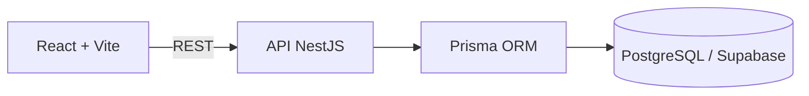

# DigiTicket

Plataforma full-stack para publicação de eventos, venda de ingressos e validação de entrada na portaria.

> Status atual: Fase 3 — gestão de eventos e catálogo público implementados.

## Sobre

O DigiTicket será desenvolvido de forma incremental. A prioridade é entregar primeiro o fluxo principal completo:

```text
Organizador publica evento
        ↓
Cliente reserva e paga
        ↓
Ingresso é emitido
        ↓
Portaria valida a entrada
```

Este README acompanha a evolução do projeto. Uma funcionalidade só será apresentada como disponível depois de implementada e verificada.

## Incluído atualmente

- Frontend com React, Vite e TypeScript.
- React Router para organização das rotas.
- TanStack Query para comunicação e estado da API.
- React Hook Form e Zod preparados para os formulários.
- Tailwind CSS configurado.
- Backend com NestJS e TypeScript estrito.
- Prisma configurado para PostgreSQL/Supabase.
- Projeto Supabase provisionado em São Paulo (`sa-east-1`).
- Data API desativada e RLS automático habilitado para novas tabelas públicas.
- Swagger/OpenAPI disponível em `/api/docs`.
- Health check disponível em `/api/health`.
- Validação global das requisições no NestJS.
- Configuração inicial de CORS, Helmet e limite de requisições.
- Arquivos `.env.example` documentados.
- Arquivos `.env` locais protegidos pelo `.gitignore`.
- Testes iniciais do health check.
- Modelo `User` e enum de papéis `ORGANIZER`, `CUSTOMER` e `GATE`.
- Migration versionada para usuários e papéis.
- Seed idempotente com quatro usuários de demonstração.
- Cadastro público restrito ao papel `CUSTOMER`.
- Login com bcrypt e emissão de JWT.
- Guards globais de autenticação e autorização baseada em papéis.
- Endpoints `POST /auth/register`, `POST /auth/login` e `GET /auth/me`.
- Limite específico de tentativas nos endpoints de cadastro e login.
- Telas de cadastro e login no frontend.
- Sessão persistida no navegador, logout e rota de perfil protegida.
- Testes unitários e e2e para cadastro, login, JWT e acesso por papel.
- Modelo `Event` com categorias, modos de venda e estados de publicação.
- CRUD de eventos restrito ao organizador proprietário.
- Publicação, cancelamento e exclusão segura de rascunhos.
- Slugs legíveis e únicos para URLs públicas.
- Catálogo público com busca, categoria, cidade, data e ordenação cronológica.
- Página pública de detalhes do evento.
- Dashboard inicial do organizador com métricas e gestão de eventos.
- Seed com um evento publicado e um rascunho de demonstração.

## Autenticação

| Método | Endpoint | Acesso | Finalidade |
| --- | --- | --- | --- |
| `POST` | `/api/auth/register` | Público | Cria exclusivamente uma conta `CUSTOMER`. |
| `POST` | `/api/auth/login` | Público | Valida as credenciais e emite um JWT. |
| `GET` | `/api/auth/me` | Bearer JWT | Retorna o usuário autenticado. |

Estas contas estão disponíveis no ambiente configurado:

| Papel | E-mail | Senha |
| --- | --- | --- |
| Organizador | `organizador@demo.com` | `Demo123!` |
| Cliente | `cliente1@demo.com` | `Demo123!` |
| Cliente | `cliente2@demo.com` | `Demo123!` |
| Portaria | `portaria@demo.com` | `Demo123!` |

## Eventos

Somente eventos com status `PUBLISHED` aparecem no catálogo. Eventos novos sempre nascem como `DRAFT`, e somente o organizador proprietário pode consultá-los ou alterá-los na área de gestão.

| Método | Endpoint | Acesso | Finalidade |
| --- | --- | --- | --- |
| `GET` | `/api/events` | Público | Lista eventos publicados com busca e filtros. |
| `GET` | `/api/events/:slug` | Público | Exibe os detalhes de um evento publicado. |
| `GET` | `/api/organizer/events` | Organizador | Lista exclusivamente os eventos próprios. |
| `POST` | `/api/organizer/events` | Organizador | Cria um evento em rascunho. |
| `PATCH` | `/api/organizer/events/:id` | Organizador proprietário | Edita um evento não cancelado. |
| `POST` | `/api/organizer/events/:id/publish` | Organizador proprietário | Publica um evento. |
| `POST` | `/api/organizer/events/:id/cancel` | Organizador proprietário | Cancela sem apagar o histórico. |
| `DELETE` | `/api/organizer/events/:id` | Organizador proprietário | Exclui somente um rascunho. |

O seed inclui `Festival Luzes da Cidade`, publicado no catálogo, e `Mostra de Cinema Brasileiro`, mantido como rascunho no dashboard do organizador.

## Arquitetura atual



O frontend não acessará diretamente o banco. Regras críticas serão implementadas no backend e protegidas também por constraints e transações no PostgreSQL quando aplicável.

## Tecnologias

### Frontend

- React
- Vite
- TypeScript
- React Router
- Tailwind CSS
- TanStack Query
- React Hook Form
- Zod

### Backend

- Node.js
- NestJS
- TypeScript
- Prisma ORM
- PostgreSQL / Supabase
- Swagger / OpenAPI

## Estrutura

```text
.
├── frontend/
│   ├── src/
│   │   ├── app/
│   │   ├── components/
│   │   ├── hooks/
│   │   ├── layouts/
│   │   ├── pages/
│   │   ├── schemas/
│   │   ├── services/
│   │   ├── types/
│   │   └── utils/
│   └── .env.example
├── backend/
│   ├── prisma/
│   ├── src/config/
│   ├── src/prisma/
│   └── .env.example
├── .gitignore
└── README.md
```

## Configuração local

### Frontend

```powershell
cd frontend
npm install
Copy-Item .env.example .env
npm run dev
```

O frontend estará disponível em `http://localhost:5173`.

### Backend

```powershell
cd backend
npm install
Copy-Item .env.example .env
npm run prisma:generate
npm run prisma:migrate:deploy
npm run seed
npm run start:dev
```

A API estará disponível em `http://localhost:3000`.

### Variáveis de ambiente

Frontend:

```env
VITE_API_URL=http://localhost:3000
```

Backend:

```env
PORT=3000
FRONTEND_URL=http://localhost:5173
DATABASE_URL=
DIRECT_URL=
JWT_SECRET=
JWT_EXPIRES_IN=7d
TICKET_SIGNING_SECRET=
TICKETMASTER_API_KEY=
```

Credenciais reais devem existir somente nos arquivos `.env`, que não são versionados.

## Configuração do Supabase

O ambiente atual usa um projeto em **South America (São Paulo)**, com Data API desativada e RLS automático habilitado. As migrations de autenticação e eventos, além do seed atual, já foram aplicadas.

Para configurar outro ambiente:

1. Crie ou abra um projeto no painel do Supabase e habilite RLS automático para novas tabelas públicas.
2. Use o botão **Connect** do projeto para consultar as connection strings.
3. Configure `DATABASE_URL` com a conexão usada pela API:
   - backend persistente com rede IPv6: conexão direta;
   - backend persistente em rede somente IPv4: **Session pooler**, porta `5432`;
   - backend serverless: **Transaction pooler**, porta `6543`.
4. Configure `DIRECT_URL` com a conexão direta, porta `5432`, para migrations. Caso sua rede não ofereça IPv6, utilize o Session pooler como alternativa.
5. Codifique caracteres especiais da senha na URL, por exemplo `@` como `%40`.
6. Aplique a migration versionada e execute o seed:

```powershell
cd backend
npm run prisma:migrate:deploy
npm run seed
```

O frontend continuará sem acessar o Supabase diretamente. Toda comunicação permanece no fluxo `Frontend → NestJS → Prisma → PostgreSQL`.

## Verificação

Frontend:

```powershell
cd frontend
npm run lint
npm run build
```

Backend:

```powershell
cd backend
npm run prisma:validate
npm run lint
npm run test
npm run test:e2e
npm run build
```

## Planejado

As próximas funcionalidades serão adicionadas e documentadas por fase:

1. Tipos de ingresso, estoque e reservas temporárias.
2. Checkout e pagamento simulado.
3. Emissão de ingressos com QR Code assinado e compartilhamento.
4. Validação de ingressos na portaria e registro de tentativas.
5. Integração para pesquisa e importação de eventos externos.
6. Mapa simples de assentos reservados.
7. Testes adicionais, acessibilidade, responsividade e refinamentos de experiência.

## Limitações atuais

- Tipos de ingresso, reservas, pagamentos e ingressos ainda não estão implementados.
- O catálogo ainda não exibe preços porque os tipos de ingresso pertencem à próxima fase.
- O ambiente usa somente a API NestJS para acessar o banco; acesso direto pelo frontend e Data API não fazem parte da arquitetura atual.
