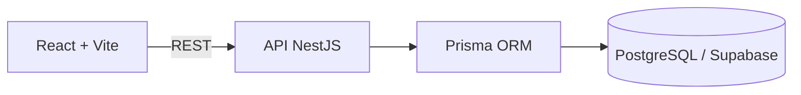

# DigiTicket

Plataforma full-stack para publicação de eventos, venda de ingressos e validação de entrada na portaria.

> Status atual: Fase 1 — fundação do projeto.

## Sobre

O DigiTicket será desenvolvido de forma incremental. A prioridade é entregar primeiro o fluxo principal completo:

```text
Organizador publica evento
        ↓
Cliente reserva e paga
        ↓
Ingresso é emitido
        ↓
Portaria valida a entrada
```

Este README acompanha a evolução do projeto. Uma funcionalidade só será apresentada como disponível depois de implementada e verificada.

## Incluído atualmente

- Frontend com React, Vite e TypeScript.
- React Router para organização das rotas.
- TanStack Query para comunicação e estado da API.
- React Hook Form e Zod preparados para os formulários.
- Tailwind CSS configurado.
- Backend com NestJS e TypeScript estrito.
- Prisma configurado para PostgreSQL/Supabase.
- Swagger/OpenAPI disponível em `/api/docs`.
- Health check disponível em `/api/health`.
- Validação global das requisições no NestJS.
- Configuração inicial de CORS, Helmet e limite de requisições.
- Arquivos `.env.example` documentados.
- Arquivos `.env` locais protegidos pelo `.gitignore`.
- Testes iniciais do health check.

## Arquitetura atual



O frontend não acessará diretamente o banco. Regras críticas serão implementadas no backend e protegidas também por constraints e transações no PostgreSQL quando aplicável.

## Tecnologias

### Frontend

- React
- Vite
- TypeScript
- React Router
- Tailwind CSS
- TanStack Query
- React Hook Form
- Zod

### Backend

- Node.js
- NestJS
- TypeScript
- Prisma ORM
- PostgreSQL / Supabase
- Swagger / OpenAPI

## Estrutura

```text
.
├── frontend/
│   ├── src/
│   │   ├── app/
│   │   ├── components/
│   │   ├── hooks/
│   │   ├── layouts/
│   │   ├── pages/
│   │   ├── schemas/
│   │   ├── services/
│   │   ├── types/
│   │   └── utils/
│   └── .env.example
├── backend/
│   ├── prisma/
│   ├── src/config/
│   ├── src/prisma/
│   └── .env.example
├── .gitignore
└── README.md
```

## Configuração local

### Frontend

```powershell
cd frontend
npm install
Copy-Item .env.example .env
npm run dev
```

O frontend estará disponível em `http://localhost:5173`.

### Backend

```powershell
cd backend
npm install
Copy-Item .env.example .env
npm run prisma:generate
npm run start:dev
```

A API estará disponível em `http://localhost:3000`.

### Variáveis de ambiente

Frontend:

```env
VITE_API_URL=http://localhost:3000
```

Backend:

```env
PORT=3000
FRONTEND_URL=http://localhost:5173
DATABASE_URL=
DIRECT_URL=
JWT_SECRET=
JWT_EXPIRES_IN=7d
TICKET_SIGNING_SECRET=
TICKETMASTER_API_KEY=
```

Credenciais reais devem existir somente nos arquivos `.env`, que não são versionados.

## Verificação

Frontend:

```powershell
cd frontend
npm run lint
npm run build
```

Backend:

```powershell
cd backend
npm run prisma:validate
npm run lint
npm run test
npm run test:e2e
npm run build
```

## Planejado

As próximas funcionalidades serão adicionadas e documentadas por fase:

1. Autenticação JWT, usuários, papéis e rotas protegidas.
2. Criação, edição, publicação e catálogo de eventos.
3. Tipos de ingresso, estoque e reservas temporárias.
4. Checkout e pagamento simulado.
5. Emissão de ingressos com QR Code assinado e compartilhamento.
6. Validação de ingressos na portaria e registro de tentativas.
7. Integração para pesquisa e importação de eventos externos.
8. Mapa simples de assentos reservados.
9. Testes adicionais, acessibilidade, responsividade e refinamentos de experiência.

## Limitações atuais

- Ainda não existem usuários nem autenticação.
- Eventos, reservas, pagamentos e ingressos ainda não estão implementados.
- Ainda não existem migrations ou seed de demonstração.
- A conexão real com Supabase depende das credenciais configuradas localmente.
# DigiTicket
